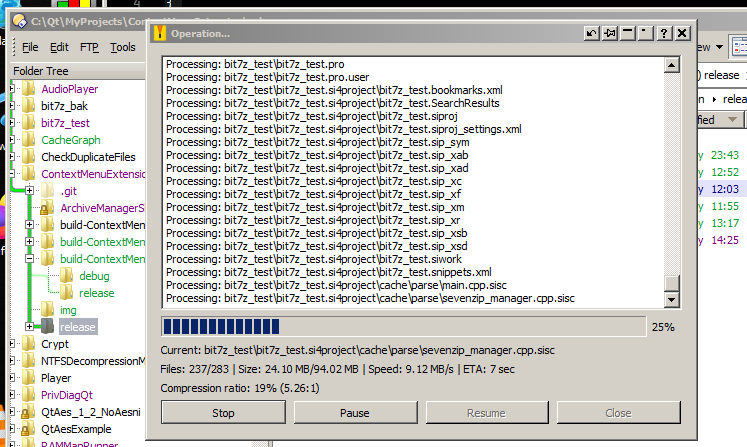
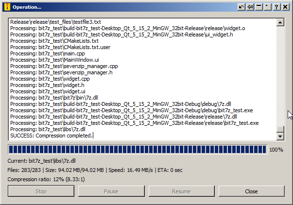

## On this site I will put things related to **IT** and what I develop. ##

### **2025-12-05** ###

I'm currently developing a C++/Qt5 compressed archive manager that uses the bit7z library.

Compressing:



Compression finished:




* * *

```
This is the END :-)
```
```c++
class CompressionProgressFunctor
{
public:
    explicit CompressionProgressFunctor(ArchiveTask* task, uint64_t totalSize, int totalFiles, int zeroByteFiles)
        : m_task(task),
          m_totalSize(totalSize),
          m_totalFiles(totalFiles),
          m_lastPercent(0),
          m_filesProcessed(new int(zeroByteFiles)),  // Pointer to shared counter
          m_startTime(0),
          m_lastUpdateTime(0),
          m_frequency(0),
          m_pausedTime(0),
          m_zeroByteFiles(zeroByteFiles)
    {
        // Get current time in milliseconds (Windows compatible)
        LARGE_INTEGER frequency;
        QueryPerformanceFrequency(&frequency);
        m_frequency = frequency.QuadPart;
        LARGE_INTEGER counter;
        QueryPerformanceCounter(&counter);
        m_startTime = counter.QuadPart;
        m_lastUpdateTime = m_startTime;
    }

    // Copy constructor - share the counter
    CompressionProgressFunctor(const CompressionProgressFunctor& other)
        : m_task(other.m_task),
          m_totalSize(other.m_totalSize),
          m_totalFiles(other.m_totalFiles),
          m_lastPercent(other.m_lastPercent),
          m_filesProcessed(other.m_filesProcessed),  // Share the same pointer
          m_startTime(other.m_startTime),
          m_lastUpdateTime(other.m_lastUpdateTime),
          m_frequency(other.m_frequency),
          m_pausedTime(other.m_pausedTime),
          m_zeroByteFiles(other.m_zeroByteFiles)
    {}

    bool operator()(uint64_t processedSize) const
    {
        if (m_task)
        {
            // Check if paused
            if (m_task->isPaused())
            {
                LARGE_INTEGER pauseStart;
                QueryPerformanceCounter(&pauseStart);
                // Wait while paused
                m_task->waitWhilePaused();
                // Calculate how long we were paused and add to total paused time
                LARGE_INTEGER pauseEnd;
                QueryPerformanceCounter(&pauseEnd);
                m_pausedTime += (pauseEnd.QuadPart - pauseStart.QuadPart);
            }
            // Check if cancelled
            if (m_task->isCancelled())
            {
                return false;  // Stop the operation
            }
        }
        if (m_task && m_totalSize > 0)
        {
            int percent = static_cast<int>((100.0 * processedSize) / m_totalSize);
            if (percent > 100) percent = 100;
            // Get current time
            LARGE_INTEGER counter;
            QueryPerformanceCounter(&counter);
            qint64 currentTime = counter.QuadPart;
            // Calculate elapsed time in seconds
            double elapsedSeconds = static_cast<double>(currentTime - m_startTime) / m_frequency;
            // Calculate speed (MB/s)
            double speedMBps = 0.0;
            if (elapsedSeconds > 0.0)
            {
                speedMBps = (processedSize / (1024.0 * 1024.0)) / elapsedSeconds;
            }
            // Calculate ETA (seconds)
            int etaSeconds = 0;
            if (speedMBps > 0.0 && processedSize > 0)
            {
                qint64 remainingBytes = m_totalSize - processedSize;
                double remainingMB = remainingBytes / (1024.0 * 1024.0);
                etaSeconds = static_cast<int>(remainingMB / speedMBps);
            }
            // Update every 100ms or when percent changes
            double timeSinceLastUpdate = static_cast<double>(currentTime - m_lastUpdateTime) / m_frequency;
            if (percent != m_lastPercent || timeSinceLastUpdate >= 0.1)
            {
                QMetaObject::invokeMethod(m_task->getManager(), "progressUpdated",
                    Qt::QueuedConnection,
                    Q_ARG(int, percent));
                QMetaObject::invokeMethod(m_task->getManager(), "detailedProgressUpdated",
                    Qt::QueuedConnection,
                    Q_ARG(int, percent),
                    Q_ARG(qint64, static_cast<qint64>(processedSize)),
                    Q_ARG(qint64, static_cast<qint64>(m_totalSize)),
                    Q_ARG(int, *m_filesProcessed),  // Dereference pointer
                    Q_ARG(int, m_totalFiles),
                    Q_ARG(double, speedMBps),
                    Q_ARG(int, etaSeconds));
                m_lastPercent = percent;
                m_lastUpdateTime = currentTime;
            }
            return true;  // Continue operation
        }
        // Fallback if no total size
        if (m_task)
        {
            int estimatedPercent = static_cast<int>(processedSize / 102400);
            if (estimatedPercent > 95) estimatedPercent = 95;
            if (estimatedPercent != m_lastPercent)
            {
                m_task->emitProgress(estimatedPercent);
                m_lastPercent = estimatedPercent;
            }
        }
        return m_task ? !m_task->isCancelled() : true;
    }

    void incrementFileCount() const
    {
        if (m_filesProcessed)
        {
            (*m_filesProcessed)++;
        }
    }

    int *getFileCounterPtr() const
    {
        return m_filesProcessed;
    }

private:
    ArchiveTask *m_task;
    uint64_t m_totalSize;
    int m_totalFiles;
    mutable int m_lastPercent;
    int *m_filesProcessed;
    mutable qint64 m_startTime;
    mutable qint64 m_lastUpdateTime;
    qint64 m_frequency;
    mutable qint64 m_pausedTime;
    int m_zeroByteFiles;
};
```


Text can be **bold**, _italic_, ~~strikethrough~~ or `keyword`.

[Link to another page](./another-page.html).

There should be whitespace between paragraphs.

There should be whitespace between paragraphs. We recommend including a README, or a file with information about your project.

# Header 1

This is a normal paragraph following a header. GitHub is a code hosting platform for version control and collaboration. It lets you and others work together on projects from anywhere.

## Header 2

> This is a blockquote following a header.
>
> When something is important enough, you do it even if the odds are not in your favor.

### Header 3

```js
// Javascript code with syntax highlighting.
var fun = function lang(l) {
  dateformat.i18n = require('./lang/' + l)
  return true;
}
```

```ruby
# Ruby code with syntax highlighting
GitHubPages::Dependencies.gems.each do |gem, version|
  s.add_dependency(gem, "= #{version}")
end
```

#### Header 4

*   This is an unordered list following a header.
*   This is an unordered list following a header.
*   This is an unordered list following a header.

##### Header 5

1.  This is an ordered list following a header.
2.  This is an ordered list following a header.
3.  This is an ordered list following a header.

###### Header 6

| head1        | head two          | three |
|:-------------|:------------------|:------|
| ok           | good swedish fish | nice  |
| out of stock | good and plenty   | nice  |
| ok           | good `oreos`      | hmm   |
| ok           | good `zoute` drop | yumm  |

### There's a horizontal rule below this.

* * *

### Here is an unordered list:

*   Item foo
*   Item bar
*   Item baz
*   Item zip

### And an ordered list:

1.  Item one
1.  Item two
1.  Item three
1.  Item four

### And a nested list:

- level 1 item
  - level 2 item
  - level 2 item
    - level 3 item
    - level 3 item
- level 1 item
  - level 2 item
  - level 2 item
  - level 2 item
- level 1 item
  - level 2 item
  - level 2 item
- level 1 item

### Small image


### Large image


### Definition lists can be used with HTML syntax.

<dl>
<dt>Name</dt>
<dd>Godzilla</dd>
<dt>Born</dt>
<dd>1952</dd>
<dt>Birthplace</dt>
<dd>Japan</dd>
<dt>Color</dt>
<dd>Green</dd>
</dl>

```
Long, single-line code blocks should not wrap. They should horizontally scroll if they are too long. This line should be long enough to demonstrate this.
```

```
The final element.
```
