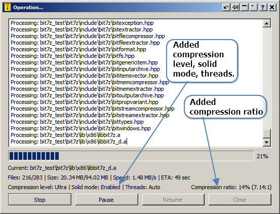
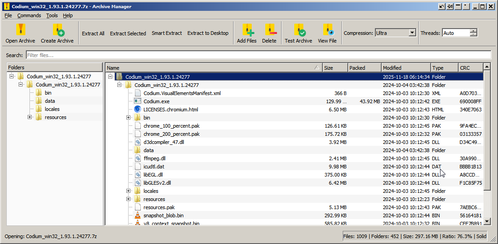
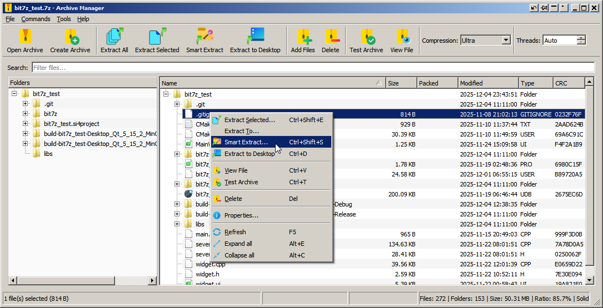
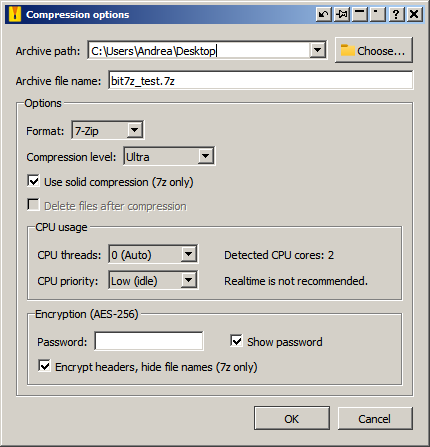
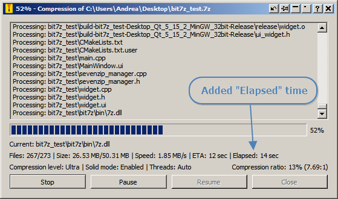
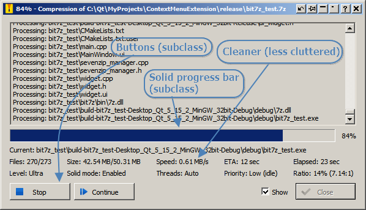
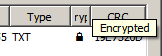
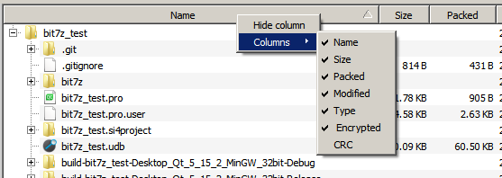
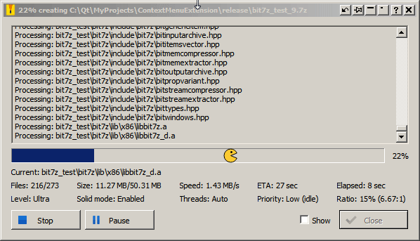

## On this site I will put things related to **IT** and what I develop. ##

<br>

### **2025-12-05** ###

I'm currently developing a C++/Qt5 compressed archive manager that uses the bit7z library.

Compressing:


Compression finished:


<br>

### **2025-12-06** ###

GUI changes:



<br>

### **2025-12-08** ###

Main window, under construction:



<br>

### **2025-12-17** ###

Main window, still under construction:



Compression options:



Compression running:



<br>

### **2025-12-18** ###

Polished:



  Buttons are subclassed from QPushButton.

  ```c++
    /**
     * @brief Custom paint event to draw the button elements.
     * @param event The paint event data.
     *
     * This implementation:
     * 1. Draws the native button bevel/background.
     * 2. Calculates the OS-specific "Shift" (e.g., 1px down/right when pressed).
     * 3. Draws the icon fixed to the left (shifted if pressed).
     * 4. Draws the text centered (shifted if pressed).
     * 5. Performs collision detection: if the button is shrunk manually and text
     *    overlaps the icon, the text is pushed to the right.
     */
```

ProgressBar is a QProgressBar subclass without chunks, solid fill.

```c++
#ifndef SOLIDPROGRESSBAR_H
#define SOLIDPROGRESSBAR_H

#include <QProgressBar>

class SolidProgressBar : public QProgressBar
{
    Q_OBJECT
public:
    explicit SolidProgressBar(QWidget *parent = nullptr);
    QSize sizeHint() const override;
    QSize minimumSizeHint() const override;
protected:
    void paintEvent(QPaintEvent *event) override;
};
#endif // SOLIDPROGRESSBAR_H
```

"Show" checkbox select file in any file manager:

```c++
void Helper::openFolderAndSelectFileEx(const QString &filePath)
{
    QFileInfo fi(filePath);
    if (!fi.exists())
    {
        qDebug() << "File does not exist:" << filePath;
        return;
    }
    // Step 1: Resolve file symlink if it exists
    QString targetFilePath = fi.absoluteFilePath();
    if (fi.isSymLink())
    {
        QString realFile = fi.symLinkTarget();
        if (!realFile.isEmpty())
        {
            targetFilePath = realFile;
        }
        else
        {
            qDebug() << "File is a broken symlink:" << filePath;
            targetFilePath = fi.absoluteFilePath(); // fallback: select the symlink itself
        }
    }
    // Step 2: Resolve folder symlink if it exists
    QFileInfo folderInfo(QFileInfo(targetFilePath).absolutePath());
    QString folderPath = folderInfo.absoluteFilePath();
    if (folderInfo.isSymLink())
    {
        QString realFolder = folderInfo.symLinkTarget();
        if (!realFolder.isEmpty())
        {
            folderPath = realFolder;
        }
        else
        {
            qDebug() << "Folder is a broken symlink:" << folderInfo.absoluteFilePath();
            folderPath = folderInfo.absoluteFilePath(); // fallback: open the symlink folder
        }
    }
    // Step 3: Combine resolved folder path and file name
    QString nativePath = QDir::toNativeSeparators(folderPath + "\\" + QFileInfo(targetFilePath).fileName());
    LPCWSTR path = reinterpret_cast<LPCWSTR>(nativePath.utf16());
    // Step 4: Try using the Windows Shell API to select the file
    PIDLIST_ABSOLUTE pidl = nullptr;
    HRESULT hr = SHParseDisplayName(path, nullptr, &pidl, 0, nullptr);
    if (SUCCEEDED(hr) && pidl != nullptr)
    {
        hr = SHOpenFolderAndSelectItems(pidl, 0, nullptr, 0);
        if (FAILED(hr))
        {
            qDebug() << "Shell API failed, falling back to opening folder:" << nativePath;
            QProcess::startDetached("explorer.exe", QStringList() << QDir::toNativeSeparators(folderPath));
        }
        CoTaskMemFree(pidl);
    }
    else
    {
        // Step 5: Shell API failed (e.g., path contains special characters), fallback
        qDebug() << "Failed to parse path with Shell API, opening folder:" << nativePath;
        QProcess::startDetached("explorer.exe", QStringList() << QDir::toNativeSeparators(folderPath));
    }
}
```

<br>

### **2025-12-23** ###

Added "Encrypted" column, header show tooltip if text is elided:



Save/Restore colmuns width and visibility with context menu on header:



<br>

### **2025-12-24** ###

PacMan on progress bar similar to WinDirStat:



Added "zzz" to PacMan when operation is paused or finished:


* * *
<br>

* * *

```
This is the END :-)
```
<dl>
<dt>Name</dt>
<dd>Andrea</dd>
<dt>Born</dt>
<dd>1973</dd>
<dt>Birthplace</dt>
<dd>Italy</dd>
<dt>Color</dt>
<dd>Blue</dd>
</dl>
